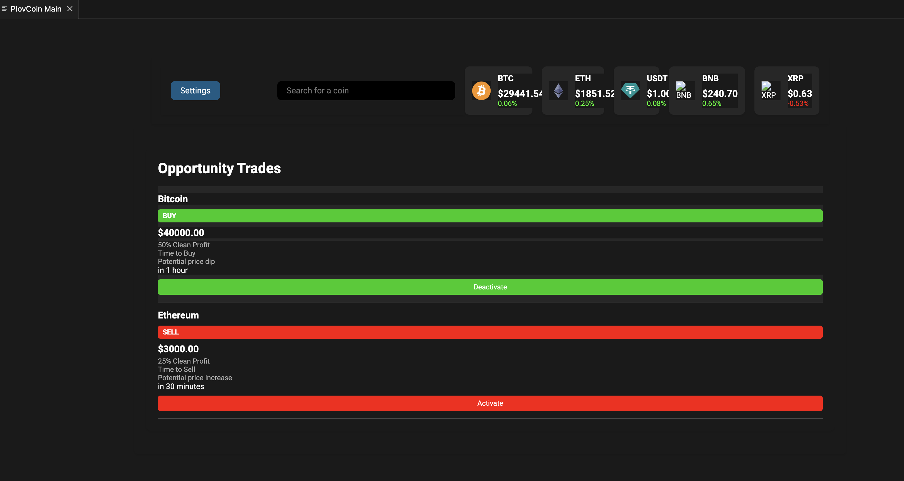
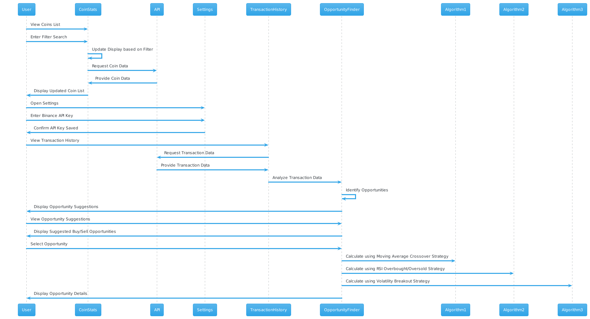

# PlovCoin CryptoCurrency and StockMarket Dashboard Extension

## Description

This is a Visual Studio Code extension that provides a CryptoCurrency Dashboard within your VS Code editor. It allows you to track and monitor cryptocurrency prices, view trading opportunities, and manage your Binance API key for trading.

## Schema

Here's a high-level schema of the extension's architecture:

## Features

- View a list of cryptocurrency prices and market data.
- Filter cryptocurrencies by name and symbol.
- Get real-time updates on coin prices.
- Set and manage your Binance API key for trading.
- Analyze trading opportunities based on transaction history.
- Receive suggested buy/sell opportunities based on different trading strategies.

## Installation

1. Install [Visual Studio Code](https://code.visualstudio.com/).
2. Open VS Code.
3. Go to Extensions (Ctrl+Shift+X).
4. Search for "CryptoCurrency Dashboard" and install the extension.
5. Open the extension's settings to set your Binance API key.

## Usage

- Open the CryptoCurrency Dashboard from the Extensions menu.
- Enter your filter criteria to search for specific cryptocurrencies.
- View real-time prices, trading opportunities, and suggestions.
- Manage your Binance API key in the extension settings.

## Contributing

Contributions are welcome! If you find a bug or have an idea for an enhancement, feel free to open an issue or submit a pull request.

## License

This project is licensed under the [MIT License](LICENSE).

---

**Disclaimer:** This extension is for informational purposes only and does not constitute financial advice. Use at your own risk.

For questions or support, contact [shusterilyaman@gmail.com](mailto:email@example.com).
